# Soulstruct for Blender

This Blender add-on enables you to import and export a large number of different FromSoftware file formats.

It's powered by [Soulstruct](https://github.com/Grimrukh/soulstruct), my giant Python library of FromSoftware formats, and Soulstruct Havok, an 
experimental expansion library.

I developed these tools over the years in parallel with the development of Dark Souls: Nightfall, and finally put aside
some time to polish and release them. I hope they serve you well and anticipate whatever mods they enable :)

**Blender 4.1 or later is required.** Earlier Blender versions use Python 3.10 (released in 2021), which I sadly do not
have the bandwidth or inclination to support any longer in Soulstruct. Surface vertex normal handling was also greatly
improved in Blender 4.1, making FLVER import/export significantly easier.

Older releases (<=1.9.3) are still available in the Releases section, which support Blender versions all the
way back to 3.7, but lack many features and are no longer updated.

## Table of Contents

- [Game Support](#game-support)
  - [Other Features](#other-features)
- [Installation](#installation)
- [Basic Usage](#basic-usage)
- [Format Information](#format-information)
  - [FLVER Models](#flver-models)
  - [Map Collision Models (HKX)](#map-collision-models-hkx)
  - [Navmesh Models (NVM)](#navmesh-models-nvm)
  - [Navmesh Models (NVMHKT)](#navmesh-models-nvmhkt)
  - [Navigation Graph (MCG)](#navigation-graph-mcg)
  - [Animations (HKX)](#animations-hkx)
  - [Map Placement Files (MSB)](#map-placement-files-msb)
- [Known Issues](#known-issues)
- [Bug Reporting](#bug-reporting)

# Game Support

- ✔️ Full: **Import and export** support.
- ⚠️ Partial: **Partial** support (e.g. import only, worse material handling, or untested).
- ❌ None: **No support** (yet).

| Game              | FLVER | Collision | Navmesh | Animation | MSB |
|-------------------|-------|-----------|---------|-----------|-----|
| Demon's Souls     | ✔️    | ✔️        | ✔️      | ❌         | ✔️  |
| Dark Souls (PTDE) | ✔️    | ✔️        | ✔️      | ✔️        | ✔️  |
| Dark Souls (Rem.) | ✔️    | ✔️        | ✔️      | ✔️        | ✔️  |
| Dark Souls 2      | ✔️    | ❌         | ❌       | ❌         | ❌   |
| Bloodborne        | ✔️    | ❌         | ❌       | ❌         | ❌   |
| Dark Souls 3      | ✔️    | ❌         | ❌       | ❌         | ❌   |
| Sekiro            | ✔️    | ❌         | ❌       | ⚠️        | ❌   |
| Elden Ring        | ✔️    | ❌         | ⚠️      | ⚠️        | ❌   |

### Other Features

- **MCG graph files** from Demon's Souls and Dark Souls can be imported as **Navigation Graph** Collections and
can even be *fully generated from scratch* using the loaded MSB Navmesh parts and models from an MSB.
  - **MCP navmesh box files** that go along with these MCGs are automatically generated when the MSB is exported, as
  their contents must match the MSB Navmesh parts and bake in their transforms.
- **NVMHKT Havok navigation mesh files** can be imported and viewed for Elden Ring, but not exported.

I hope to eventually turn most remaining ⚠️ and ❌ symbols in the above table into ✔️ symbols, but it's hard work --
especially support for huge modern MSB files and Havok formats. If there's one feature that you want to see soon, I'm
happy to consider it as a commission (which is how Demon's Souls support was added).

However, before you ask, it's **unlikely that Collision export support will expand much further**. Havok's collision
physics system changed radically in 2014 (Bloodborne onwards) and I don't have the tools (or expensive Havok SDK) to be
able to regenerate the bounding volume tree structures in these newer files (`hkcd` and `hknp` Havok classes). I may
eventually add import support so you can at least view the collision meshes in Blender, though.

# Installation

This is an experimental add-on that is not yet published to Blender. To install the add-on manually, follow these steps:

1. Ensure you have **Blender 4.1 or later**, as Python 3.11 is required.
2. Download the add-on `.zip` file from the GitHub repository (Releases).
3. Unzip the contents into your Blender's **user** `scripts/addons` directory.
   - On Windows, the directory is typically at `C:/<User>/AppData/Roaming/Blender Foundation/Blender/<version>/scripts/addons/`.
   - **Do not** unzip the contents into the Blender installation directory (e.g. in `Program Files`). The Soulstruct
   module may not have write access there. If you see a `PermissionError` when trying to enable the add-on in Blender, 
   check you haven't done this!
4. Open Blender and go to `Edit > Preferences > Add-ons`.
5. In the Add-ons tab, find `Import-Export: Soulstruct` and enable it by checking the box next to it.
   - If you see an error, particularly one about `soulstruct` module import, double check that `io_soulstruct_lib` is
   installed in the `scripts/addons` directory next to `io_soulstruct`.
6. Press the N key in the 3D View window or click the little arrow in the top-right and you should see many new tabs
   including `FLVER`, `Animation`, and so on.

If you would like to install or update the add-on directly from Git without an official GitHub release, clone and 
update (or just download) the repo, and update the contents of `scripts/addons/io_soulstruct` from the main 
`io_soulstruct` folder in the repo.

**Note that updated `io_soulstruct` versions without zip releases may also use newer versions of `soulstruct` and 
`soulstruct-havok` that need to be installed into `scripts/addons/io_soulstruct_lib`.** I'll eventually add these as Git
submodules to the repo. (You can update `io_soulstruct_lib/soulstruct` yourself using the [Soulstruct repo](https://github.com/Grimrukh/soulstruct), but 
as `soulstruct-havok` isn't public yet, this will be impossible to update.)

Whenever you update an add-on in Blender, you will need to either restart Blender (recommended) or call the 
`Reload Scripts` function from Blender.

Add-ons directory (you may have other add-ons and files here, like I do):
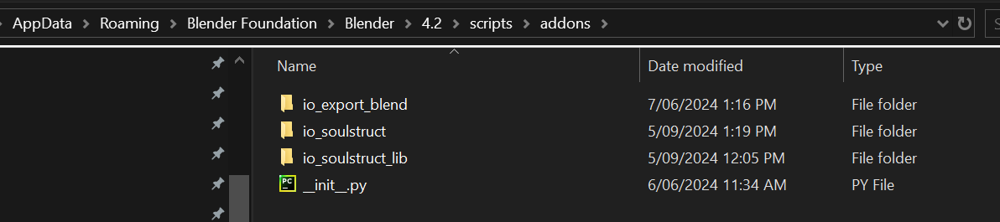

Add-ons tab in Blender Preferences, after searching for 'Soulstruct':
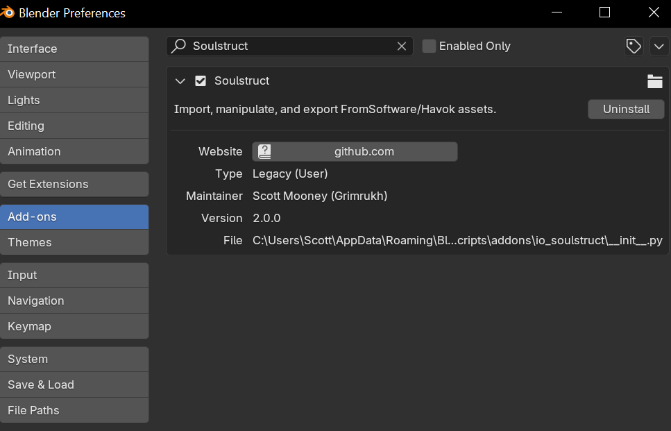

# Basic Usage

The add-on implements many different operators for importing and exporting supported file types. These can be accessed
in the new menus on the right of the 3D View.

The add-on also defines new **Blender Object subtypes** for the FromSoft file types supported by Soulstruct. You can
see the subtype (if any) of the currently active Object at the bottom of the `General Settings` tab. (You can also
theoretically modify its subtype here, but usage of this would be rare and require lots of other steps.)

**NOTE: Blender uses a vertical Z axis and a right-handed coordinate system, while FromSoft games use a vertical Y axis
and a left-handed coordinate system.** Soulstruct will automatically convert between these systems when importing and
exporting 3D positions and rotations. You should never need to worry about it when just working inside Blender, but keep
it in mind, as *copy-pasting 3D coordinates/rotations from raw FromSoft data or other applications like DSMapStudio will
require you to do the transformations yourself*. To transform between FromSoft and Blender positions and rotations, 
follow these rules (noting that they work in both directions):
- For positions, just swap Y and Z. No negation.
- For rotation Euler angles, swap Y and Z, then negate all three components.

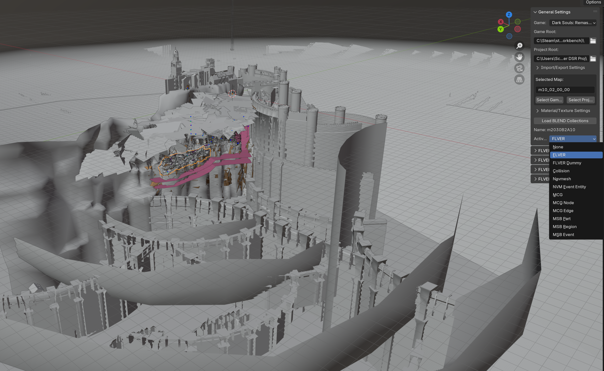

If an Object has a Soulstruct subtype, that subtype's properties will be exposed in a new Panel in the Object Properties
window:

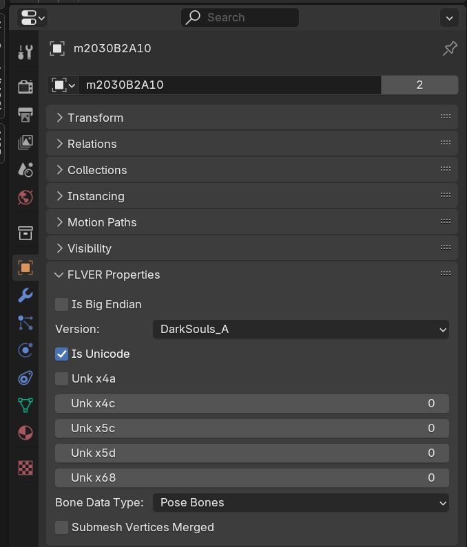

File import/export is handled using a **Game** directory and a **Project** directory, both of which can be set in
`General Settings`. The Game directory is the root directory of a game installation (containing the EXE or BIN) and the
Project directory should be a directory that mimicks the structure of the Game directory.

Many import operators will automatically find all relevant files in either the Game or Project directory (depending on 
which is defined and whether `Prefer Import from Project` is enabled) and offer a convenient choice of file to import.
Many export operators will automatically export files to the selected Project directory if given (and the Game 
directory, if `Also Export to Game` is enabled). Some of these operators also require a current `Selected Map`, which 
should have format `m??_??_??_??` and correspond precisely to a folder inside the `'map'` subdirectory of the 
Game/Project directory. You can edit the name of this map directory, or use one of the buttons provided to choose an
existing folder name from the Game or Project.

# Format Information

### FLVER Models

The core `FLVER` object is represented by a Blender `Mesh` Object. For simple static FLVERs such as Map Pieces, the 
`Mesh` and its Blender materials may hold all necessary data. However, for other FLVERs that support animations (or Map
Pieces that use FLVER bones as a way to offset certain groups of vertices), the `Mesh` Object will be a child of a
Blender `Armature` Object that holds the FLVER bones and controls the `Mesh` through weighted vertex groups.
- For static Map Piece FLVERs, each vertex must be weighted to **exactly one bone**.
- For animated FLVERs, each vertex must be weighted to **between one and four bones**.

This is done through Blender vertex groups that match the name of one of the bones in the `Armature` (see the `Data` 
Panel in the mesh's Object Properties window). If you're in Edit Mode on this `Mesh`, you can use the `Data` Panel to 
select vertices in groups or re-assign them. Unfortunately, it's not straightforward to tell how many different bones a
vertex is weighted to (i.e. how many groups it appears in), but Soulstruct will report the index of any vertex illegally
weighted to no bones or more than four bones (or more than one bone for Map Pieces).

*NOTE: Every FLVER file needs at least one bone, including static Map Pieces. If this bone is at the origin and has no 
non-default properties (and the FLVER has no Dummies), Soulstruct will not bother creating an `Armature` parent when 
that FLVER is imported as long as the `Omit Default Bone` option is enabled, and will instead just re-create that 
default bone, and weight all vertices to it, when the `Mesh`-only FLVER is exported.*

If a FLVER has any Dummies -- arbitrary points in the model that can be used for various purposes like sound effects,
visual effects, hitboxes, and event scripting commands (also known by names like 'Model_dmy', 'dummy poly', or 
'damipoly'-- these will also be children of the FLVER `Armature` (which will always be created if any Dummies are
present) next to the `Mesh`. Dummies are a new Soulstruct subtype of `Empty` Objects in Blender and have several
properties that can be set in the `FLVER Dummy Properties` Panel in the Object Properties window. Some info:
- They are usually parented to a specific bone in the `Armature`, known as the 'attach bone', which is the bone followed
by the Dummy during animations. This can be seen in the `Relations` Panel in the Object Properties.
- They also may have an extra 'parent bone' (not to be confused with their Blender parent -- I know, the name is 
unfortunate) that is simply used by FromSoft as a way to group Dummies together by purpose. The name of this parent bone
is just a string in the `FLVER Dummy Properties` Panel (usually 'sfx_dmy', 'Model_dmy') and is generally a root bone 
that isn't ever used by animations.
- The most important property of each dummy is its **reference ID**. This is so important that it is stored directly in
the Dummy's name, which follows a tightly controlled format: `{model_name} Dummy<{index} [{reference_id}]`. The model
name is only used to make sure the Dummy has a unique name across Blender, and the index is only used to make sure that
Dummies are listed in the same order as the FLVER file, but the reference ID is real data that determines how every
other game file (TAE, EMEVD, etc.) refers to this Dummy. Multiple Dummies can have the same reference ID (e.g. 200,
which is used at all the points where death visual effects are spawned)."

Each FLVER Material -- and some Submesh properties -- are represented by a Blender `Material`. Each material has a 
number of properties that can be set in the `FLVER Material Properties` Panel in the Material Properties window:

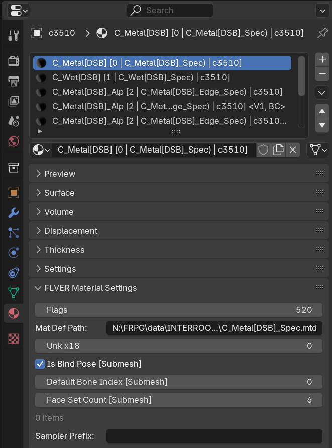

Each FLVER `Mesh` in Blender is a combination of all 'submeshes' that appeared in the FLVER file, which are already
optimized for rendering but often painful to edit separately due to being disconnected along certain edges (e.g. where
a grass texture changes to a rock texture on the ground). If `Merge Submesh Vertices` is enabled when the FLVER is
imported, these submeshes will be merged into a single mesh by Soulstruct using a complicated algorithm that takes
materials and vertex information into account. Otherwise, the submeshes will remain disconnected. Either way, each face
in the Blender `Mesh` is assigned to a Blender `Material` that reflects a combination of its FLVER material and a
handful of FLVER submesh properties that Soulstruct stores on each Blender `Material`:
- `Is Bind Pose`: enabled for rigged/animated FLVER meshes and disabled for static FLVERs (generally just Map 
Pieces). This tells the game how to interpret vertex bone indices and weights. (Note that some Object FLVERs contain
both static and animated submeshes.)
- `Default Bone Index`: this seems to be rather useless and is often zero.
- `Face Set Count`: number of face sets in the FLVER submesh, typically used for different levels of detail.
Soulstruct cannot yet generate LODs, but has the option to copy the max-detail `Mesh` to this many face sets when
the FLVER is exported (only recommended for older games that don't use particularly dense models!).
- `Backface Culling`: this property is a real Blender `Material` property found in the `Settings` Panel
(specifically, `Backface Culling (Camera)` under the `Surface` section). If enabled, the back faces of each FLVER
face will not be rendered in-game. Typically only disabled for FLVERs that are meant to be seen from both sides,
like plants and trees.
- The other `FLVER Material Settings` are:
  - `Flags` (an unknown bit field I can't help with)
  - `Mat Def Path` (the path of the game material file that defines this material's appearance)
  - `Unk x18` (an unknown integer that is usually zero)

Soulstruct will attempt to find the `MTD` file (or `MATBIN` in Elden Ring) that defines each FLVER Material. This is
necessary to properly handle FLVER UV layers, as these are tightly packed in each FLVER submesh and need to be properly
assigned to named layers in Blender depending upon their material usage (otherwise, lightmap UVs may overlap with
standard texture UVs, and so on). Soulstruct will also attempt to build a faithful Blender node tree that reflects the
type of shader used by that MTD. This is all done manually by me right now and may not work, but even if FLVER materials
aren't displayed properly, all of their information can be manipulated and exported as above.
- Typically, the names of textures used by each material sampler are stored and retrieved by Soulstruct from the Image
Texture nodes in the node tree. However, if the node tree creation fails, these texture names will be stored under the
`Custom Properties` Panel in the Material properties instead. They may be missing their `Sampler Prefix`, which is an
optional string that can be set in `FLVER Material Settings` and allows the sampler names to be shortened in `Custom
Properties` (mostly for Elden Ring's ludicrous, convoluted sampler names).
- Actual textures will only be imported if enabled upon FLVER import. In this case, Soulstruct will first try to find
them in the `Image Cache Directory` set in General Settings (if given and if `Read Cached Images` is enabled), then look
in the appropriate known place depending on the type and location of the FLVER being imported. If the latter is done, 
the textures will be cached as the desired format (`.tga` by default) in the `Image Cache Directory` for future use, as
long as `Write Cached Images` is enabled.
- You can otherwise edit the shader to your heart's content; it will not affect export, other than any changes to the
Blender `Texture` instances assigned to named Image Texture (sampler) nodes. **Let me know if you want to contribute
to node tree generation or have a suggestion for correcting material handling!**

**NOTE:** When exporting a FLVER model, only the part of its Blender name **before the first space and/or dot**
(whichever comes first) will be used as the model name. This means you can add any extra information you want, and
Soulstruct itself will e.g. add known Character names inside angular brackets for your convenience on FLVER import.

### Map Collision Models (HKX)

Collision meshes are Havok mesh files (`.hkx`) that are placed in maps to define physical boundaries, killplanes, and
more. The HKX file is complicated, but ultimately is just a collection of one or more simple meshes, each with a
material index that determines its physical material, sound effects, and so on (wood, stone, metal, grass, ...). Each
mesh subpart is assigned to a different Blender `Material` containing the material index in its name; this index is the
only actual information associated with each Collision model.

**NOTE:** Just as with FLVER models, when exporting a Collision model, only the part of its Blender name **before the 
first space and/or dot** (whichever comes first) will be used as the model name. The hi-res ('h') and lo-res ('l')
collision HKX files will both be created, with the appropriate subparts (by Blender `Material`) saved to each. It
doesn't matter whether the model name itself starts with an 'h' or 'l'.

**Demon's Souls users**: If you are importing collisions from the unused map `m07_00_00_00`, note that these collisions
do not have FromSoft's custom material data attached. Soulstruct will initialize the entire mesh with default material 0
but you will want to assign materials yourself before exporting. (Exporting will automatically use the proper format.)

### Navmesh Models (NVM)

These are just meshes that define the walkable areas of a map. They are tightly connected to the MCG 'navigation graph'. 
Each face can have one or more flags attached to it (typically just zero or one), which is represented by a Blender 
`Material` (but not *stored* in that `Material`, unlike collision materials above). The flags can be modified through 
the `NVM Navmesh Tools` Panel under the `Navmesh` tab, as can the `Obstacle Count` of each face. The material will be 
updated in Blender automatically when the flags are changed.

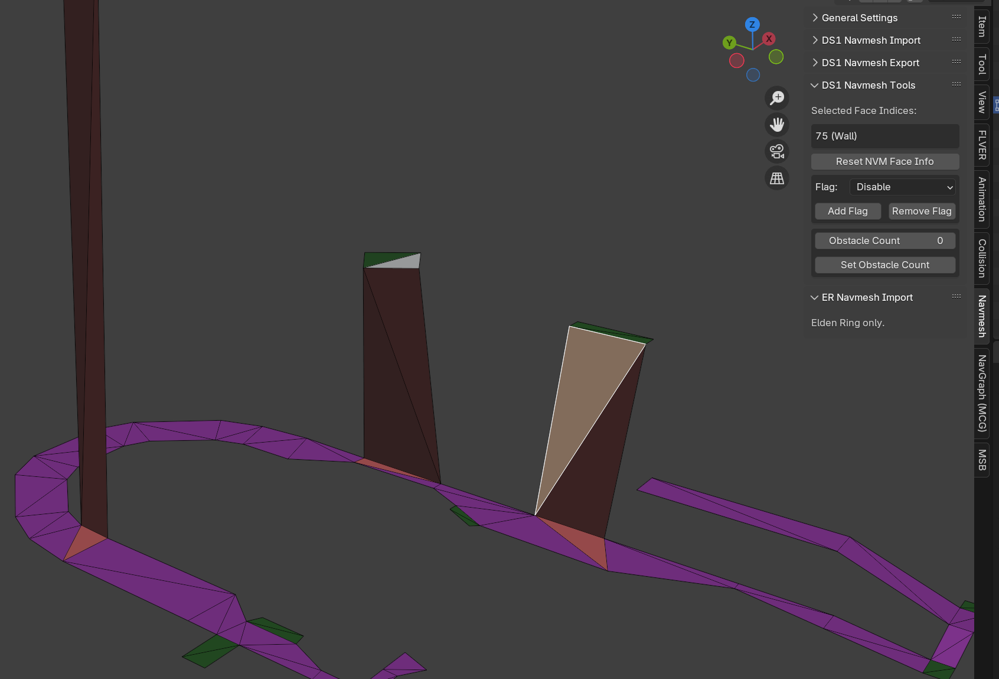

**NOTE:** Just as with FLVER models, when exporting a Navmesh model, only the part of its Blender name **before the 
first space and/or dot** (whichever comes first) will be used as the model name.

### Navmesh Models (NVMHKT)

Elden Ring navmeshes are stored in Havok files. Currently, Soulstruct has rudimentary import support for these meshes,
so you can look at Elden Ring navmeshes. I have no plans to support export, as the Havok file contains a ton of other
navigation data that would have to be reconstructed.

### Navigation Graph (MCG)

A complicated navigation graph that accompanies the navmeshes for each map in DS1. It directly indexes Navmesh parts
in the MSB of the same map; these MSB parts must be imported before the MCG can be imported, as the Nodes and Edges in
the MCG directly reference the MSB parts in Blender.

Each MCG node sits at the boundary between **exactly two MSB Navmesh parts** and connects to all other Nodes that touch
either of those navmeshes. The MCG edges that connect the nodes reference the MSB Navmesh part they pass through, and
have a `Weight` property that affect how the game calculates paths through the graph. Soulstruct displays these weights
by default.

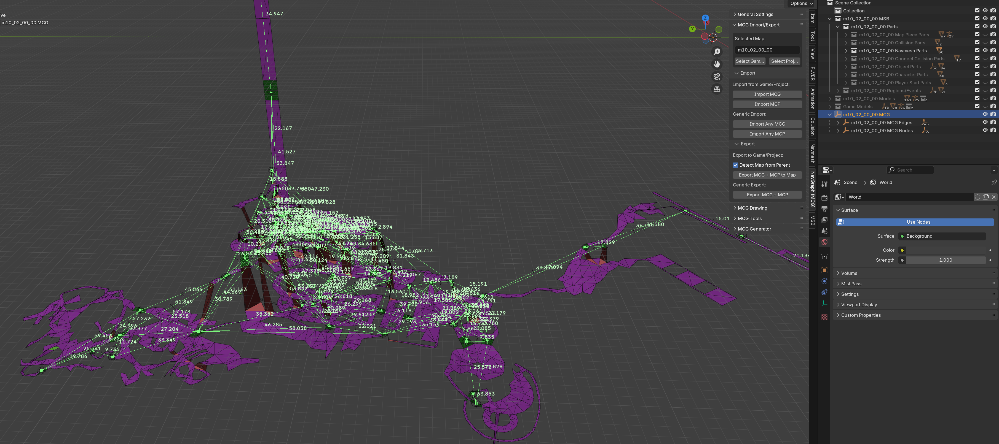

Each MCG node also references the index of at least one Navmesh model face for each of the two MSB Navmesh parts that it
touches. These faces **should be flagged as Exit** in the Navmesh model (dark green) and typically lie very close to the
node. If you select an MCG edge, the faces of that edge's linked MSB Navmesh that are referenced by the two nodes of 
that edge will (by default) by drawn in red (Node A) and blue (Node B), which you can use to check the graph.

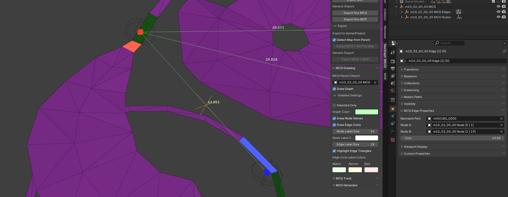

I have reverse-engineered the algorithm that the game uses to calculate edge weights -- in most cases, at least, as it 
depends on the Navmesh model flags too. You can test it out under the `NavGraph (MCG)` tab in the `MCG Generator` Panel
by selecting at least one edge and clicking `Recompute Edge Costs`. This will use my attempted algorithm to calculate
the weight of that edge based on the position of its nodes and the linked MSB Navmesh part's model. The new value will
be stored under `Custom Properties` as `New Cost` and compared to the real `Cost` under `MCG Edge Properties`. Depending
on how close these values are, the cost that appears in the 3D View will be colored green with a tick (exact match),
yellow (close match), or red (far off), so you can quickly see how my algorithm does.

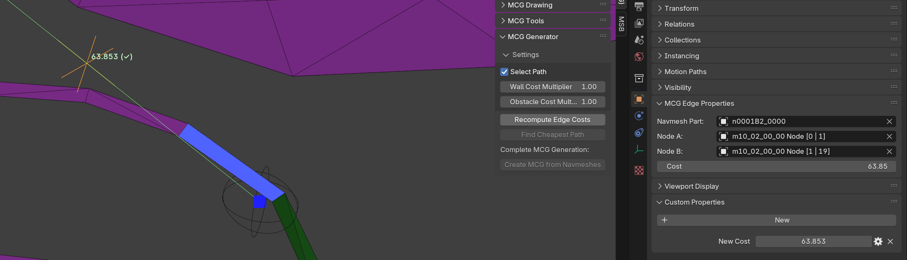

Alternatively, you can select the full Collection of MSB Navmesh parts for a map, and click `Create MCG from Navmeshes`.
Soulstruct will **create MCG nodes wherever adjacent Navmesh Exit faces touch** and connect them with edges through all
shared Navmesh parts, computing edge costs with my approximate algorithm (realistically, you probably won't notice the
effects of any differences).

*NOTE: When an MCG is exported, if `Auto-generate MCP` is enabled, Soulstruct will automatically create the MCP file 
that goes with it, which is a simple collection of connected AABBs that correspond to the list of MSB Navmesh parts and
their MCG connections.*

### Animations (HKX)

Animation files (HKX) that animate FLVER skeletons are supported for import and export. These animations are stored in
`ANIBND` Binders for Characters and Objects/Assets (nested inside `OBJBND`/`GEOMBND` Binders for the latter). If you
select a Character or Object/Asset FLVER in Blender (`Mesh` or its parent `Armature`), the `Import Character Anim` or
`Import Object/Asset Anim` operators will become available in the `Animation` tab. These will automatically find the
associated `ANIBND` and offer a choice of animations from inside it to import.

FromSoft animations are 30 FPS for all games, but will be converted to 60 FPS in Blender by interpolating every second
frame as long as `To 60 FPS` is enabled. **Make sure the Frame Rate is set to 60 FPS in the `Scene` Properties Panel to
view these animations properly:**

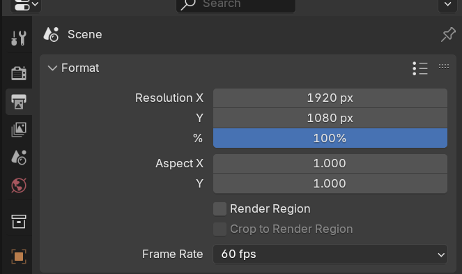

Of course, you could disable `To 60 FPS` and set the Scene frame rate to 30 as well, but the animations will look like
they're playing (unsurprisingly) at 30 FPS, even though their speed is correct.

There isn't much more to say about animations. Some miscellaneous points:
- Fortunately, the format hasn't changed much between Dark Souls 1 and Elden Ring.
- Since the imported data is keyframe-complete (computed from the spline-compressed Havok data), the first thing you may
want to do is run the `Decimate (Ratio)` Blender operator to cut the keyframes down to a manageable level, with
appropriate interpolation settings. Data for every frame will be computed when the animation is exported, regardless of
the keyframes that define the animation.

## Map Placement Files (MSB)

Soulstruct now supports **full MSB import and export for Demon's Souls and Dark Souls 1 (either version)**. 

All Parts, Regions, and Events are imported. Part models can be imported as desired by type (and/or glob pattern), as
FLVER import in particular is quite slow (especially for a high number of unique Map Pieces) and you may not need to
edit or even see all models. Any models that aren't imported (whether it's because they were disabled or the file was
missing) will be represented by a low-poly icosphere in a Collection called `Placeholder Models`. Character and Object
models are kept in a Collection called `Game Models`, as they are game-wide, and Map Piece, Collision, and Navmesh
models are kept in sub-Collections in a parent Collection called `{MapStem} Models`. **You may wish to turn off 
visibility for the Model Collections after import if you only care about the MSB.**

Parts are instantiated by sharing the mesh data of their Model (FLVER, Collision, or Navmesh). **Parts are a separate
Soulstruct types to their models, and only expose their MSB properties.** You can edit base Part properties in the 
`MSB Part Properties` Panel, and the Part subtype properties in the `MSB {Subtype} Properties` Panel below it in the
Object Properties window:

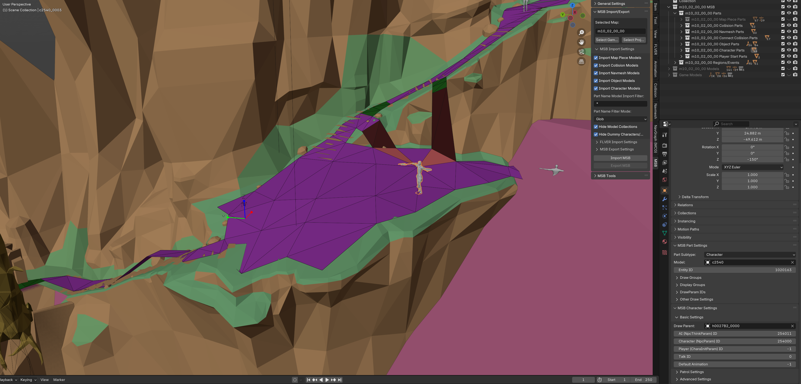

Note that Draw Groups and other bit groups are individual bools hidden in sub-panels, and some settings that you are
unlikely to touch (according to me, generally because they don't work) are hidden under `Advanced Settings` sub-panels.
Aside from these settings, the **only data that will be exported to the MSB is the Object's transform (location, 
rotation, and scale)**. (Note that in Dark Souls 1, MSB scale does not apply to Havok physics or animations, so it's
only useful for Map Pieces and certain static Objects.)

Regions and Events are more straightforward, and are both kept in the same collection called `{MapStem} Regions/Events`.
- When exporting an MSB, **Part names will only include the part of the Blender name before the first space and/or 
dot**, just like when exporting models. However, Regions and Events will be named **exactly as they are in Blender**,
including any disambiguating Blender suffix like `.001`. Since vanilla MSBs often contain duplicate Region/Event names,
this means that you may get some name changes when exporting an MSB even without changing any data.
- The `MSB Region Settings` Panel exposes Region data, which is barebones in Dark Souls 1 and only contains an `Entity ID`
for EMEVD event scripts, a `Shape` dropdown for the Region shape, and appropriate shape dimensions depending on the
chosen shape type.
- The `Mesh` of the Region will update automatically when the shape is changed, and Soulstruct will attempt to port 
existing dimension values between types (e.g. Cylinder radius becomes Sphere radius and vice versa) so you can test out 
different shapes. Note that the origin of each `Mesh` may not match Blender conventions: a Box placed at the origin, for
example, will sit on the horizontal plane in Blender rather than having the world origin at its center.
- The Blender scale of the Region is automatically driven by the shape dimensions, so you will see it highlighted in
purple and will not be able to edit it manually.
- Regions with `Point` shapes will be represented by simple three-axis meshes, and by default, will have RGB axes drawn
over the top to make sure they stand out and are orientation highly visible.
- MSB Events have no transform data, and are instead **parented to the Part or Region they are attached to** in Blender
  (meaning they may also appear in the appropriate MSB Part Collection). They are represented by Blender `Empty` Objects
  and will therefore follow their parent Part/Region as it is moved around. (Many Regions exist only for Events to
  attach to, and of course, later FromSoft games actually changed these spatial Events to just be Region subtypes.)

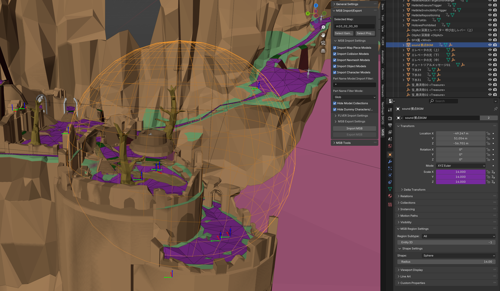

The `MSB Tools` Panel under the `MSB` tab contains useful operators:
- **Event Coloring**. Select a color and an Event subtype (or all subtypes) and apply it to color the wireframes of
those Events in the 3D View. This is useful for quickly identifying different types of Events in a complex map. Note
that Wireframe Color must be set to `Object` in Viewport Shading options to see this coloring.
- **Find Entity ID**. A pop-up will ask for an Entity ID, and will select the Part or Region with that ID if it
exists. This is a useful way to find something referred to in an EMEVD event script.
- **Enable/Disable Selected Names**. A handy shortcut for enabling or disabling floating names in the 3D View for all
selected Blender objects.
- **Create MSB Part**. Select a Model (FLVER, Collision, or Navmesh) and click this to create a new MSB Part with
default settings inside the selected map's MSB Collection (which will be created if missing). New MSB Regions and 
Events are best created by just copying another one and editing its properties.
- **Single-User Model**. Create a full duplicate of this Part's model (FLVER, Collision, or Navmesh) in Blender, so
that any further changes to the Part's model will not affect any other Parts that shared the original model. The
name of the new model will be detected from the start of the Part's name but both can be changed afterward using the
`Rename FLVER` operator in the `FLVER` tab (under `FLVER Model Tools > Other Tools`). Make sure to use this, and not
just change the `Mesh` name, because there are many references to the FLVER's name inside its various data blocks.

You must **select the MSB parent Collection to export it.**

Other miscellaneous notes/tips:
- Parts with FLVER models (Map Pieces, Characters, Player Starts, Objects) will never export their models at the same
time as the MSB, as this is complicated to arrange and would generally not need to be done when changing MSB data. To
modify or export a FLVER model, find it in its appropriate `Models` Collection and export it from there. (Note that
changing the `Mesh` of an MSB Part in Edit Mode will modify the same `Mesh` in the FLVER model, so be careful!)
- Collision and Navmesh Parts *do* have the option to export their models at the same time as the MSB because (a) these
model formats are *much* faster to write than FLVERs, (b) you will find yourself modifying Collision and Navmesh model
data rather than their MSB transform to place them, and (c) Navmeshes are tightly connected to their models and the
MCG file.
- I recommend setting Wire Color to `Object` and Color Mode to `Material` in Viewport Shading. Soulstruct assigns
convenient viewport colors to Collisions and Navmeshes based on their materials/flags (as seen in these screenshots),
and setting Wire Color to `Object` will allow you to see any custom MSB Event coloring you have done.
- You can also set Color Mode to `Texture` to quickly view FLVER textures (if imported) in the 3D View without Blender
doing any real rendering. This can be useful for quickly checking that textures are assigned and mapped correctly. Use
the `Material Preview` Viewport Shading mode to see more accurate rendered FLVER textures.

## Known Issues

- I have done exactly zero testing with **Dark Souls III**. FLVER files can probably be imported and exported, but 
material shaders may not be handled well or at all.
- Support for at least Dark Souls 2 FLVER models is likely to come.
- More comprehensive documentation and video tutorials to come.

## Bug Reporting

If you come across any problems or bugs, please file a Git bug report to help me improve the add-on.

Version 2.0 was a signifificant overhaul, so bare with me if any new bugs have appeared.
